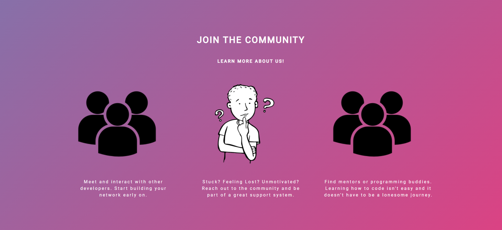
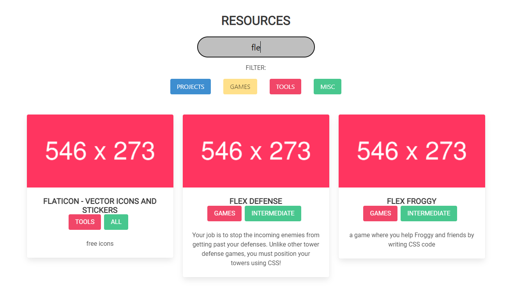

# Tech-It-Out (Front-end,Back-End)
 

A REACT based application that integrate front-end and back-end. That stores information in the database and presents it to the front-end. 

## Table of Contents

-[Installation](#installation)
-[Objectives](#objectives)
-[Screenshot](#screenshot)
-[Roles](#roles)
-[Contributing](#contributing)
-[Questions](#questions)
-[License](#license)

## Installation

1. open in the terminal
2. Git clone 
3. Cd into the new directory and in the server.js folder
4. Download the required pakages npm i
5. npm run build 

## Objectives 
```
Tech-it-Out is a user-friendly app. Its sole purpose is to create an environment that beginner developers can visit to utilize a collection of web-development resources.
```

## Screenshots

<p align="center">
    
    
</p>

## Roles
* Emily Vasquez - Lead Designer
* Gustavo Tijerino - Front-End
* Jalen McNeal - Front-End/Back-End Support
* Neema Velasco - Server, Front-End Support

## Tests
This application has no tests as of the moment.

## Contributing 
If you would like to contribute to this project feel free to reach out at the email below. By contributing, you agree that your contributions will be licensed under its MIT License. 

## Questions 

If there are additional questions contact emily.m.vazquez99@gmail.com

## License
This code is licensed under [MIT License](https://mit-license.org/).


